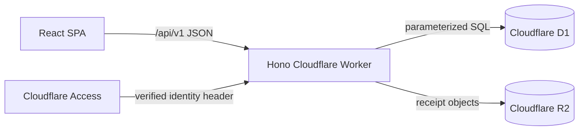

# Architecture

## System overview

VKB Farm Manager is a mobile-first shared-farm ledger and operations application. V1 covers expenses, settlements, reporting, plantation inventory, harvest revenue, private receipt documents, reference settings, a traceable Excel migration, and an asset-only PWA shell.

## Component boundaries

- `src/` is the React 19/Vite client. Feature modules keep their UI, schemas, typed API calls, and tests together; `src/lib/` contains shared client contracts such as formatting, API fetch, query keys, and identity.
- `worker/` is one Hono application. Route modules are thin HTTP adapters; services own domain rules; repositories own parameterized D1 access; middleware owns identity, roles, and error envelopes.
- `migrations/` owns the normalized D1 schema and reference seeds. The database is authoritative for people, categories, ledger records, settlements, inventory, harvests, documents, and audit history.

## Data and API flow

The browser calls `/api/v1` through a typed envelope client. TanStack Query caches server state and feature mutations invalidate dependent consumers. The Worker applies identity/role middleware to protected API routes, validates writes with Zod, transforms money once at the service boundary, and returns sanitized errors. D1 stores money as integer paise and ISO local transaction dates; timestamps use UTC.

## Identity and authorization

Cloudflare Access must protect every production and preview hostname. The Worker accepts its identity header only in that boundary, finds an active `people` row, and uses the mapped `admin`, `editor`, or `viewer` role. In local mode only, an explicitly enabled development admin identity is available. A missing production identity is a 401, never a development fallback.

## Deployment and cross-cutting concerns

Cloudflare Vite serves static assets and the Worker handles `/api/*`; SPA fallback supports route refreshes. D1 and R2 bindings are declared in `wrangler.jsonc`; production IDs and Access coverage are account configuration, not repository secrets. Known validation, authentication, authorization, not-found, conflict, and storage cases use the shared error envelope. Worker observability is enabled in Wrangler.

The service worker caches only versioned same-origin assets and a navigation shell. It handles `/api` first and always delegates API reads, writes, CSV, and document streams to the network. Production build/deploy scripts explicitly select the `production` Wrangler environment; local development explicitly selects `development`. Browser acceptance uses a separate disposable local D1/R2 store with production identity behavior.
